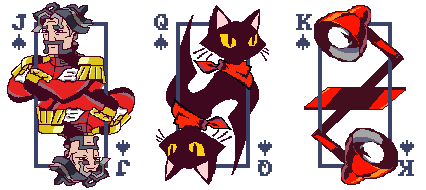
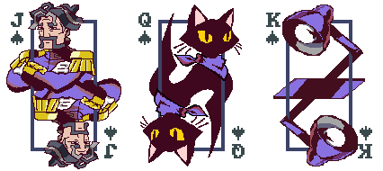
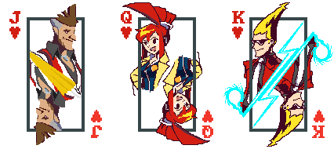

# Ghost Trick Skin Pack for Balatro

A custom card skin mod for Balatro that replaces the face cards (Jack, Queen, King) with graphics inspired by the Ghost Trick: Phantom Detective video game.

## Preview

### Spades (Low Contrast)

### Spades (High Contrast)

### Hearts (Low Contrast)

### Hearts (High Contrast)

### Diamonds (Low Contrast)

### Diamonds (High Contrast)

### Clubs (Low Contrast)

### Clubs (High Contrast)

## Dependencies

- [Lovely](https://github.com/ethangreen-dev/lovely-injector).
- [Steamodded](https://github.com/Steamodded/smods) (version 1.x or higher).

## Installation

Download the [project](https://github.com/RGTriforce/BalatroGhostTrickSkins/archive/refs/heads/main.zip) or the latest [release](https://github.com/RGTriforce/BalatroGhostTrickSkins/releases) and check Steamodded instructions on "[How to Install a Mod](https://github.com/Steamodded/smods?tab=readme-ov-file#how-to-install-a-mod)". The deck will be available on the `Options -> Customize Deck` menu.

## Credits

- **nuclearbirb** - Card art
- **RGTriforce** - Code implementation

## License

This mod is licensed under the `GNU GPL Version 3` specified in the `LICENSE` file.
